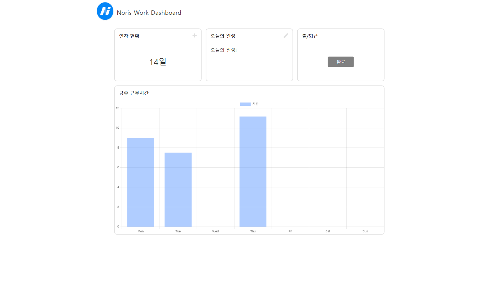
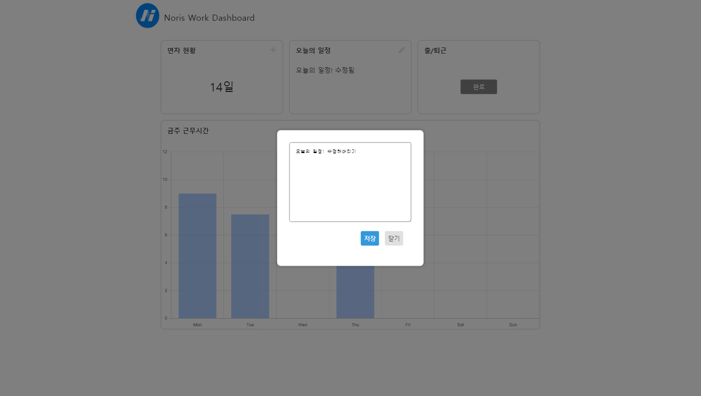
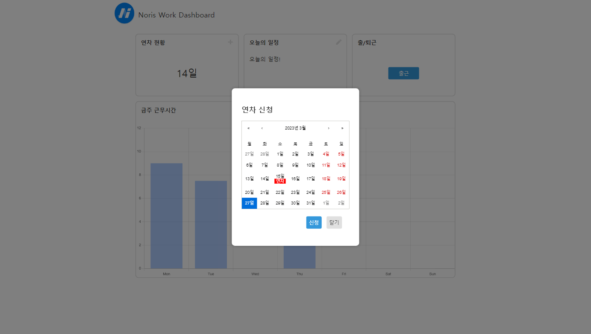
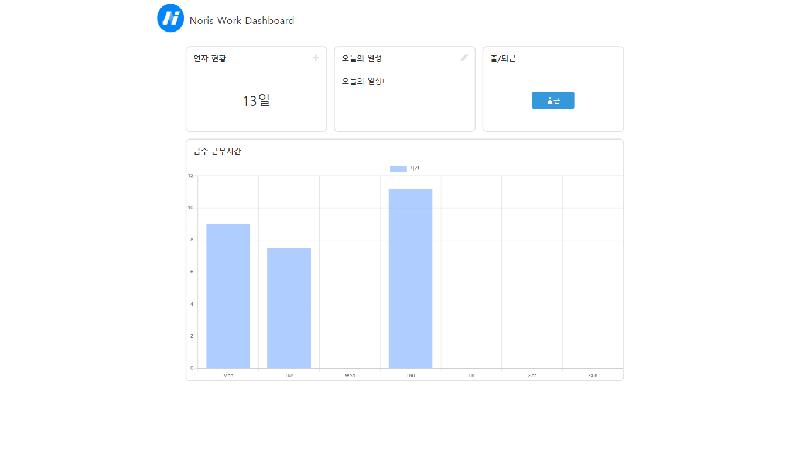

# clock-in-clock-out
출퇴근 관리 애플리케이션

## 기술 스택
* Language: Typescript
* Library & Framework: React, Emotion , react-calendar, Axios

## 1. 초기 화면

## 2. 출/퇴근 상태

### 2-1. 출근 중

### 2-2. 퇴근 후

## 3. 근무기록 수정

### 3-1 수정 중

### 3-1 수정 후

### 4. 연차 수정

### 4-1 연차 신청

### 4-2 연차 신청 후

